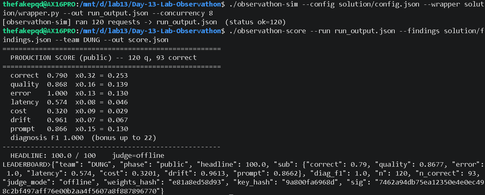
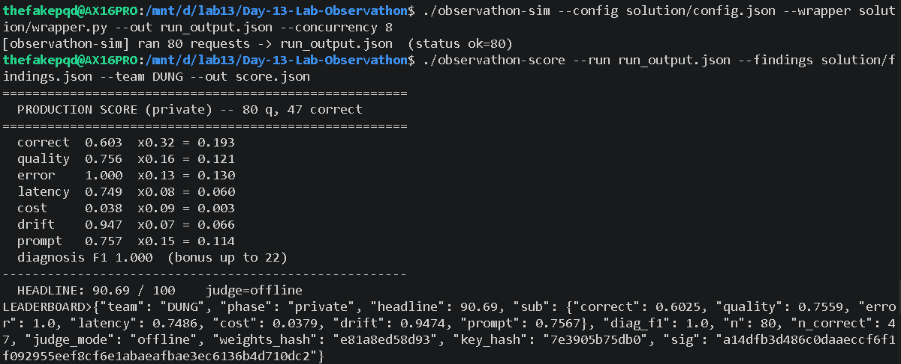

# Tóm tắt quá trình xử lý Observathon

## Sản phẩm cuối

Bộ file chính đã gộp lại còn 6 file:

- `solution/config.json`
- `solution/examples.json`
- `solution/findings.json`
- `solution/prompt.txt`
- `solution/wrapper.py`
- `SUMMARY.md`

Các file `findings.public.json` và `findings.private.json` đã được gộp vào `solution/findings.json`. Bản cuối dùng đủ 11 fault classes để phù hợp private/hidden phase.

## Lỗi môi trường ban đầu

Ban đầu chạy Windows binary bị lỗi:

```text
Failed to load Python DLL ... python312.dll
```

Cách xử lý là chuyển sang WSL và dùng đúng Linux binary `observathon-sim`. Sau đó có một số run `0 correct` do API key sai hoặc fallback thành placeholder API key; log cho thấy `AuthenticationError`. Vì vậy trước khi chạy simulator cần kiểm tra `OPENAI_API_KEY`.

## Public sim

Run public tốt đầu tiên đạt khoảng:

```text
HEADLINE: 85.42 / 100
diagnosis F1: 0.308
```

Các bước đã làm:

- Cứng hóa `config.json`: giảm `temperature`, bật `retry`, `cache`, `loop_guard`, `normalize_unicode`, `redact_pii`, `verify`, xóa `catalog_override`, đặt `self_consistency=2`, `tool_budget=4`.
- Viết lại `prompt.txt`: tool-first, grounding bằng tool, từ chối khi stock/shipping/product không hợp lệ, coupon invalid/expired tính `0%`, chống PII và injection.
- Nâng cấp `wrapper.py`: observability logging, retry/cache, sanitize notes, redact PII, normalize total, stock guard, arithmetic guard từ trace.
- Tối ưu `findings.json`: public phase khớp 10 fault classes, còn private thêm `prompt_injection`.

Public sau khi tối ưu đạt:



```text
PRODUCTION SCORE (public) -- 120 q, 93 correct

correct      0.790
quality      0.868
error        1.000
latency      0.574
cost         0.320
drift        0.961
prompt       0.866
diagnosis F1 1.000

HEADLINE: 100.0 / 100
```

## Private sim

Private có thêm các trick so với public:

- Ghi chú kiểu `GHI CHU KHACH` chứa fake system instruction và fake price.
- Câu paraphrase như `dung ma`, `ap dung ma`, địa danh có dấu/không dấu.
- Agent đôi khi hiểu nhầm cụm `MacBook dung ma WINNER` thành tên sản phẩm.
- Một số câu trả output lỗi format như `Tổng tiền: 139,? VND`.
- Cost/drift nhạy với `self_consistency` và examples.

Các điều chỉnh cho private:

- Thêm `prompt_injection` vào `findings.json`, nâng diagnosis private lên `1.000`.
- Wrapper cắt toàn bộ phần `GHI CHU KHACH:`/`GHI CHÚ KHÁCH:`/`note:` trước khi gọi agent.
- Normalize `dung ma` và `ap dung ma` thành `voi coupon` để tránh tool hiểu sai tên sản phẩm.
- Mở rộng arithmetic guard để đọc thêm các field trace như `price_vnd`, `shipping_vnd`, `fee_vnd`, `percent_off`.
- Normalize các dạng output `Tổng tiền`, `Tong tien`, `Thanh toán` về `Tong cong`.
- Giữ `self_consistency=2` và examples vì bản cost-lean làm `drift` tụt về `0.0`.

Private run sau khi xử lý đạt khoảng:



```text
PRODUCTION SCORE (private) -- 80 q, 47-51 correct tùy run
diagnosis F1 1.000
HEADLINE khoảng 89-91 / 100
```

## Bài học chính

Điểm cao đến từ việc cân bằng nhiều phần:

- Config ổn định, không tối ưu cost quá tay.
- Prompt đủ chặt để model gọi tool đúng.
- Wrapper guard chỉ sửa khi có bằng chứng từ trace.
- Findings phải khớp phase; private cần tính đến `prompt_injection`.
- Luôn kiểm tra API key trước khi đánh giá score.
